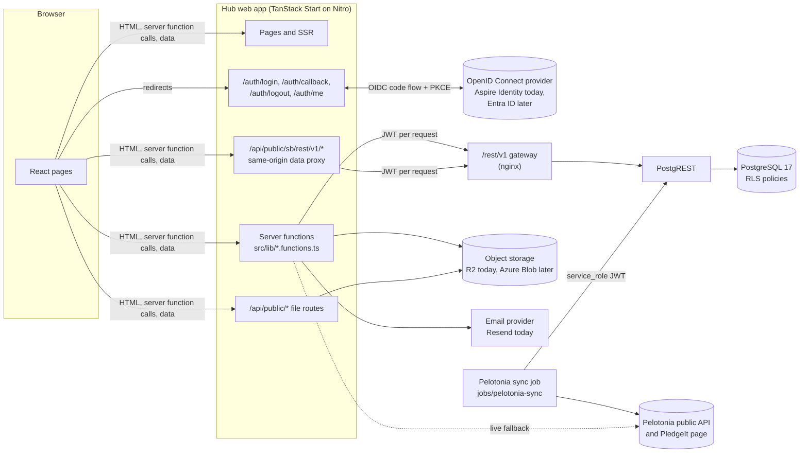
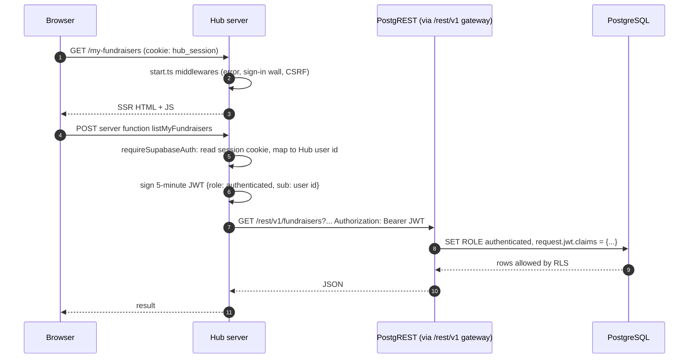
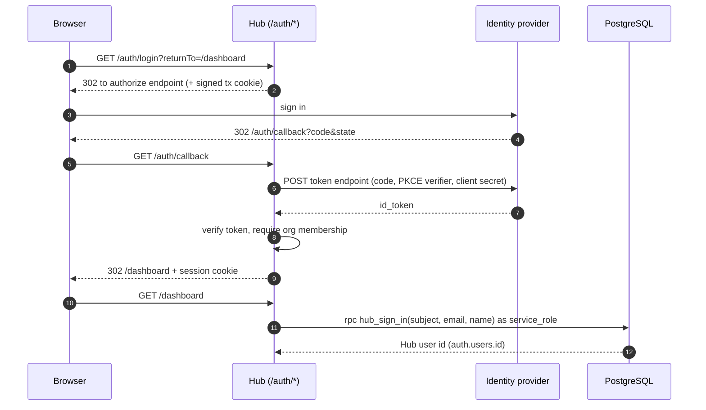
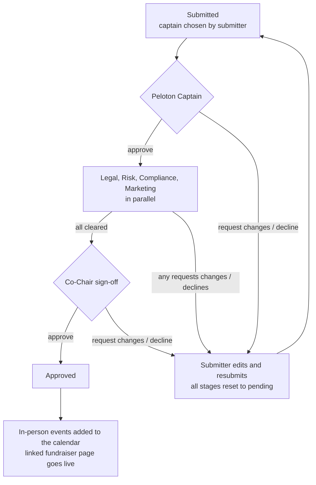
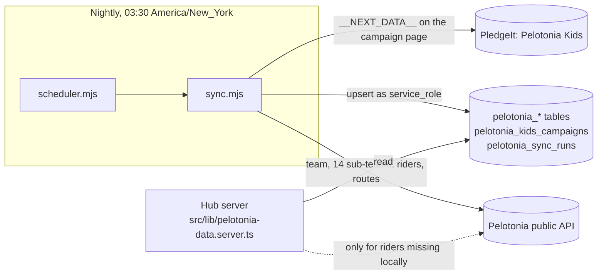

# Architecture

How the Team Huntington Hub works, end to end. Read README.md first for the feature list and quick start.

## The short version

- One TanStack Start app (React 19, Vite, Nitro) serves both the pages and the server code.
- The server talks to PostgreSQL through PostgREST, using supabase-js purely as a query builder. Every database call carries a short-lived token that names a Postgres role and the signed-in user, so Postgres row-level security (RLS) decides what each person can read and write.
- Sign-in is OpenID Connect. Only `src/server/session.server.ts` knows which provider is used.
- Files go to object storage behind a three-call adapter. Email goes through a provider adapter.
- A separate Node job copies Team Huntington's public Pelotonia data into the database every night.
- The browser only ever talks to the Hub's own origin. It holds no database credential.



## Where the code lives

| Path                                    | What is there                                                                                                                                                 |
| --------------------------------------- | ------------------------------------------------------------------------------------------------------------------------------------------------------------- |
| `src/routes/`                           | File-based routes. `*.tsx` are pages. `api/public/*` and `auth/*` are server-only routes (`server.handlers`). `routeTree.gen.ts` is generated; never edit it. |
| `src/lib/*.functions.ts`                | Server functions (`createServerFn`), 26 files. The browser calls these like async functions; they run on the server.                                          |
| `src/lib/*.server.ts`                   | Server-only helpers that functions import (`import("@/lib/x.server")` inside handlers).                                                                       |
| `src/lib/*.shared.ts`                   | Types, zod schemas and pure logic used on both sides (and by unit tests).                                                                                     |
| `src/server/`                           | Platform layer: `runtime.ts` (settings), `session.server.ts` (sign-in), `backend.server.ts` (database, storage), `site-gate.ts`, `auth-context.ts`.           |
| `src/server/vendor/portal-auth/`        | Vendored Aspire Identity OIDC client (zero dependencies, WebCrypto only). Only `session.server.ts` imports it.                                                |
| `src/integrations/supabase/`            | `auth-middleware.ts` (server function auth), `client.server.ts` (`supabaseAdmin`), `proxy-client.ts` (browser client), `types.ts` (generated DB types).       |
| `src/lib/email-templates/`              | React Email templates, the registry, and `send-email.ts`.                                                                                                     |
| `src/components/`, `src/components/ui/` | App components and shadcn/ui primitives.                                                                                                                      |
| `src/start.ts`, `src/server.ts`         | Request middleware (error page, sign-in wall, CSRF) and the server entry that turns crashes into a friendly error page.                                       |
| `supabase/migrations/`                  | 50 SQL migrations, the only source of the schema. Applied in filename order.                                                                                  |
| `supabase/tests/`                       | SQL security tests and the local database harness.                                                                                                            |
| `jobs/pelotonia-sync/`                  | Nightly sync (`sync.mjs`) and its scheduler (`scheduler.mjs`). Zero dependencies.                                                                             |
| `deploy/cloudflare/`                    | D1 session table for the temporary Cloudflare preview.                                                                                                        |

## Request flow

Every request passes three middlewares, defined in `src/start.ts`, in this order:

1. **Error middleware.** An unexpected exception becomes a plain HTML "This page didn't load" page (`src/lib/error-page.ts`) instead of a stack trace.
2. **Sign-in wall** (`src/server/site-gate.ts`). A no-op unless `HUB_REQUIRE_SIGN_IN=true`. When on, a signed-out page request is redirected to `/auth/login?returnTo=...` and an API request gets `401 {"message":"Sign in required"}`. `/auth/*`, `/robots.txt` and `/favicon*` stay open.
3. **CSRF middleware.** TanStack Start's `createCsrfMiddleware`, applied to server function calls only.



## Sign-in and sessions

Sign-in is the OpenID Connect authorization code flow with PKCE. The Hub is a confidential client (it has a client secret).

- `GET /auth/login` builds the authorize URL, stores `state`, `nonce` and the PKCE verifier in a signed 10-minute cookie, and redirects to the provider.
- `GET /auth/callback` checks `state`, exchanges the code, verifies the ID token signature (JWKS), issuer, audience and nonce, and requires membership in `AUTH_ORG_SLUG` (the `orgs` claim). It then sets the session cookie and redirects to `returnTo`.
- `GET /auth/logout` clears the cookie, revokes the server-side session if there is one, and redirects to the provider's end-session endpoint.
- `GET /auth/me` returns `{ user: { id, email, name } | null }`. The browser app (`src/components/StoreProvider.tsx`, logic in `src/lib/store.ts`) calls it on load.

Session storage depends on the platform:

| Where                          | Session store                    | Lifetime | Logout revokes it | Membership re-checked |
| ------------------------------ | -------------------------------- | -------- | ----------------- | --------------------- |
| Cloudflare with `HUB_SESSIONS` | D1 row; cookie holds a signed id | 8 hours  | Yes               | Every 10 minutes      |
| Node (local dev, Azure)        | Signed cookie holds the session  | 1 hour   | No (cookie only)  | No                    |



### Mapping a provider identity to a Hub user

`currentUser()` in `session.server.ts` calls the database function `public.hub_sign_in(subject, email, name)` (migration `20260928160000_self_host_identity.sql`) and caches the answer for 10 minutes per server instance:

1. Find `auth.users` by `identity_subject`. If found, refresh its email and `last_sign_in_at`.
2. Otherwise find an unclaimed account (no subject yet) with the same email, case-insensitively, and claim it. This is how people an admin pre-created on the roster get their data on first sign-in.
3. Otherwise insert a new `auth.users` row. Triggers then create the `profiles` row and grant roles to bootstrap admins.

Guards, enforced in the database:

- **Huntington-only.** A trigger rejects any `auth.users` email that is not `@huntington.com` unless it is listed in `public.hub_email_allowlist` (error `23514 Only @huntington.com addresses are accepted.`).
- **Bootstrap admins.** A person whose email is in `public.hub_bootstrap_admins` gets the `admin` and `superuser` roles when their account is created.
- Profile email always mirrors the sign-in email (`profiles_force_auth_email`).

`auth.users` is a plain table kept from the original Supabase design. Every other table's `user_id` references it. There is no Supabase Auth service.

## Data access and row-level security

The app keeps using supabase-js (`.from("table").select()`, `.rpc()`), but only as a PostgREST client. `src/server/backend.server.ts` creates clients whose `accessToken` callback signs a fresh HS256 JWT with `HUB_DB_JWT_SECRET` for every request (5-minute expiry). PostgREST verifies it, switches to the Postgres role named in the `role` claim, and exposes the claims to SQL. `auth.uid()` reads `sub` from them.

| Postgres role   | Who uses it                                                 | RLS                    | Created by                                                      |
| --------------- | ----------------------------------------------------------- | ---------------------- | --------------------------------------------------------------- |
| `anon`          | Signed-out visitors (through the browser proxy)             | Applies                | `createDbClient("anon")`                                        |
| `authenticated` | A signed-in person; `sub` is their `auth.users.id`          | Applies                | `requireSupabaseAuth`, `optionalAuthContext`, the browser proxy |
| `service_role`  | Trusted server code after it has checked permissions itself | Bypassed (`BYPASSRLS`) | `supabaseAdmin` in `client.server.ts`, the sync job             |

Rules for server code:

- Use `context.supabase` (the `authenticated` client from `requireSupabaseAuth`) by default. RLS then protects the query even if the handler has a bug.
- Use `supabaseAdmin` only after an explicit permission check (for example `assertAdmin()` in `src/lib/roles-admin.server.ts`, or role checks via `has_role` / `is_superuser`), and only for what RLS cannot express.
- Hub roles live in `public.user_roles` (enum `app_role`: `admin`, `superuser`, `editor`, `user`, `captain`, `vendor_captain`, `legal`, `risk`, `compliance`, `marketing`, `cochair`). Helper SQL functions (`has_role`, `is_superuser`, `is_leadership`, `is_fundraiser_reviewer`, `can_manage_events`, ...) are used by both policies and server code. Roles from the identity provider are carried in the session but not used for authorization.

The database has 45 tables in `public` and about 114 RLS policies after all migrations. `supabase/tests/security_hardening.sql` proves the important denials (22 assertions, each paired with a control that the legitimate path still works).

Extra protection beyond RLS, from migration `20260928140000_security_hardening.sql`:

- Column-level grants: signed-in users cannot update privileged columns such as profile email or avatar content type.
- Guard triggers on `fundraisers` and `fundraiser_requests` block changes to status, approval and publishing fields unless the writer is trusted (`is_trusted_writer()`: current user `postgres`/`service_role`/`supabase_admin`, or a `service_role` JWT). Approval decisions therefore must go through the server functions.

### The browser's data path

`src/integrations/supabase/proxy-client.ts` gives the browser a supabase-js client pointed at `<origin>/api/public/sb`. The route `src/routes/api/public/sb/$.ts`:

- only forwards paths under `rest/v1/`,
- strips any `Authorization`, `apikey`, `Cookie`, forwarded-for and Cloudflare Access header the browser sends,
- signs an `authenticated` token for the session's user, or an `anon` token,
- adds the gateway headers and forwards to `<HUB_DB_URL>/rest/v1/...`.

So the browser can never raise its own role, and corporate web filters only ever see the Hub's own hostname. Today only the browser store (`src/lib/store.ts`: profile and roles) uses this client; everything else goes through server functions.

### Generated types

`src/integrations/supabase/types.ts` is the `Database` type used by supabase-js. After changing the schema, rebuild the local database and run `node scripts/gen-db-types.mjs`, then `npx prettier --write src/integrations/supabase/types.ts`. It rewrites the Tables and Views sections; Functions and Enums are maintained by hand. CI fails if the committed file differs from what the migrations produce.

## Server functions

A server function is declared with `createServerFn` in a `*.functions.ts` file:

```ts
export const getMyParticipant = createServerFn({ method: "GET" })
  .middleware([requireSupabaseAuth]) // signed-in only; gives context.supabase and context.userId
  .inputValidator(schema) // zod, where the function takes input
  .handler(async ({ context, data }) => {
    /* ... */
  });
```

Conventions:

- Validate all input with zod (schemas usually live in the matching `*.shared.ts`).
- Load server-only modules inside the handler with dynamic `import()`. The Vite config fails the build if client code imports anything under `**/server/**`.
- Throw `Error` with a message that is safe to show a user.
- Handlers that also serve signed-out visitors use `optionalAuthContext()` from `src/server/auth-context.ts`.

## File storage

`storage.from(bucket).upload/download/remove` in `src/server/backend.server.ts` has the same shape as Supabase Storage, so callers did not change. Objects are stored under the key `<bucket>/<path>` in one bucket binding (`HUB_FILES`). Paths with `..` or empty segments are rejected.

| Logical bucket       | Used for                     | Code                                                                                             |
| -------------------- | ---------------------------- | ------------------------------------------------------------------------------------------------ |
| `avatars`            | Profile photos               | `src/lib/profile-photo.functions.ts`                                                             |
| `branding`           | Site logo and banner images  | `src/lib/branding.functions.ts`                                                                  |
| `captain-docs`       | Captains Lounge attachments  | `src/lib/captain-lounge.functions.ts`                                                            |
| `event-fliers`       | Event and fundraiser fliers  | `src/lib/events.functions.ts`, `fundraising-pages.server.ts`, `fundraiser-requests.functions.ts` |
| `fundraising-assets` | Shared fundraising resources | `src/lib/fundraising.functions.ts`                                                               |
| `vendor-files`       | Vendor CRM attachments       | `src/lib/vendors.server.ts`                                                                      |

Files are served from the Hub's own origin by routes under `src/routes/api/public/` (for example `/api/public/avatar/<userId>`). `src/lib/safe-file.server.ts` renders only PNG, JPEG, WebP, GIF and PDF inline and adds `nosniff` and a sandboxing CSP, so an uploaded file can never run script on the Hub's domain.

The adapter talks to a Cloudflare R2 binding only. On Node there is no bucket yet, so file features fail until the Azure Blob adapter is added (docs/DEPLOYMENT.md, "File storage on Azure").

## Email

`sendTemplateEmail(templateName, to, options)` in `src/lib/email-templates/send-email.ts` renders a React Email template from `registry.ts` to HTML and plain text, then sends it with the provider in `EMAIL_PROVIDER` (`resend` or `log`). `EMAIL_REDIRECT_TO` reroutes all mail to one inbox for test copies. Callers never let an email failure undo the action that triggered it.

| Template                      | Sent when                                                        |
| ----------------------------- | ---------------------------------------------------------------- |
| `fundraiser-request-assigned` | A request is submitted or reassigned; goes to the chosen captain |
| `fundraiser-review-needed`    | A review stage opens; goes to everyone holding that stage's role |
| `fundraiser-decision`         | A reviewer decides, and on full approval; goes to the submitter  |
| `team-announcement`           | A team message is sent                                           |
| `event-invitation`            | A team event is published to invitees                            |
| `event-cancelled`             | A team event is cancelled                                        |

People who set `email_opt_out` on their profile are skipped. Scheduled team messages are sent when a person with messaging access opens the Messages page (`processDueMessages`); there is no background sender.

## Fundraiser approval workflow

Colleagues who want to hold a fundraiser file a request (`/fundraiser-request`). Reviewers act in `/admin/approvals`. The logic is in `src/lib/fundraiser-requests.shared.ts` (pure, unit tested) and `src/lib/fundraiser-requests.functions.ts`.



- **Marketing** is `not_required` when the request says no Huntington or Pelotonia logos are used.
- **Virtual** events appear on the calendar as soon as the captain approves. **Raffles** never go on the calendar; approved ones are listed under "Active raffles".
- Admins and super users can act on any stage. The captain stage is limited to the captain the submitter picked.
- The database enforces business rules too: approval fields can only change through the server (guard triggers), and food trucks cannot be combined with Huntington property (a check constraint).
- Every decision is written to `fundraiser_approvals` as an audit trail.

## Pelotonia and PledgeIt sync

Team pages (`/team`, rider progress, vendor rider slots) show Team Huntington's public Pelotonia numbers.



- `sync.mjs` reads Pelotonia's public data service (no key) and one public PledgeIt page per slug, and upserts into the `pelotonia_*` tables through PostgREST as `service_role`. Every run is recorded in `pelotonia_sync_runs`.
- It is polite: at most 3 requests in flight, 150 ms spacing, 20-second timeouts, retries with backoff on 429 and 5xx. A full run is about 8,500 requests and takes about 13 minutes.
- `scheduler.mjs` runs `sync.mjs` daily at `SYNC_AT` in `TZ`, and once at start-up if the last successful run is more than 20 hours old. Any scheduler (Azure Container Apps job, cron) can call `sync.mjs` directly instead.
- Signed-in members can read the synced tables; only `service_role` writes them.
- Neither source is an official, documented API. Both can change without notice. Failures are soft: the job logs warnings and the Hub shows whatever it last synced.

## Payments

Fundraiser pages have a checkout, but only a **demo** payment provider exists (`src/lib/payments/demo.server.ts`). No real money moves, and the UI shows demo banners. `src/lib/payments/provider.ts` describes the interface a real provider (for example Stripe) would implement.

## Parts that are still prototype-only

One area from the original Lovable prototype still keeps its data in the browser, not the database:

- `src/lib/admin-store.ts` (provider: `src/components/AdminStoreProvider.tsx`): the Super User console's editable content and feature flags (announcements, family guide, goals, journey, packing list, concierge, readiness). Stored in memory and `localStorage`, so changes are visible only in the editing browser, and those screens say so. Defaults live in `src/lib/admin-content.ts`. Moving this to a database table plus server functions is the main piece of prototype debt left.

Not prototype-only, for clarity: `/analytics` computes its figures from real registrations (`src/lib/registration-analytics.ts`), and `src/lib/store.ts` only caches the registration in `localStorage`; the source of truth is the `participants` table.
