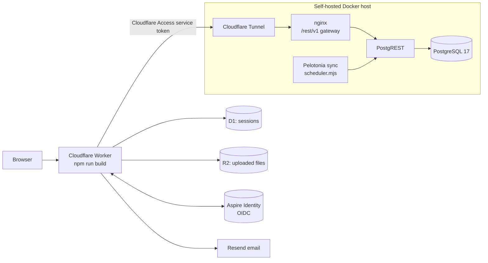
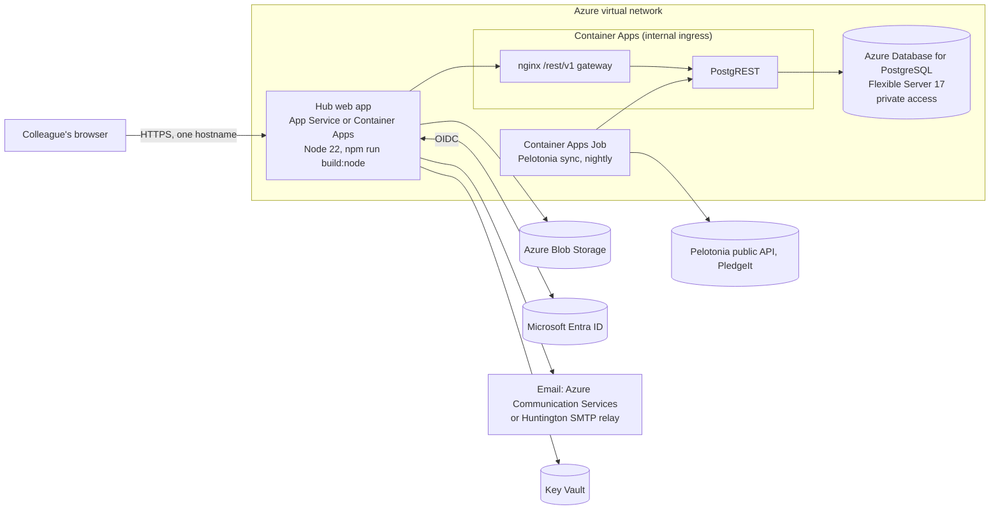

# Deployment

Two parts:

- **A. The temporary preview** that runs today. It is a stopgap so Chris and a few colleagues can use the Hub. Huntington does not need to operate or copy it.
- **B. The recommended Huntington deployment on Azure.** This is the target.

Settings are described in [CONFIGURATION.md](CONFIGURATION.md). Moving existing data is in [DATA-EXPORT.md](DATA-EXPORT.md). Sign-in with Entra ID is in [ENTRA.md](ENTRA.md).

## A. The temporary preview

The preview runs at `ridewithhuntington.madebyotten.com`, behind sign-in (`HUB_REQUIRE_SIGN_IN=true`). It will be shut down once Huntington hosts the Hub.



| Piece    | How it runs today                                                                                                                                                                                                                                                                                 |
| -------- | ------------------------------------------------------------------------------------------------------------------------------------------------------------------------------------------------------------------------------------------------------------------------------------------------- |
| Web app  | Cloudflare Worker `ride-with-huntington`, built with `npm run build` (the `cloudflare-module` Nitro preset). Configuration in `wrangler.jsonc`; secrets set with `wrangler secret put`.                                                                                                           |
| Sessions | D1 database bound as `HUB_SESSIONS`. Table from `deploy/cloudflare/d1-migrations/0001_portal_sessions.sql`.                                                                                                                                                                                       |
| Files    | R2 bucket bound as `HUB_FILES`.                                                                                                                                                                                                                                                                   |
| Sign-in  | Aspire Identity (the builder's OpenID Connect service), organization `team-huntington`, client `team-huntington-hub`.                                                                                                                                                                             |
| Database | PostgreSQL 17, PostgREST and an nginx `/rest/v1` gateway in Docker Compose on a self-hosted machine. The only way in is a Cloudflare Tunnel hostname protected by a Cloudflare Access service token (`HUB_DB_ACCESS_CLIENT_ID` / `HUB_DB_ACCESS_CLIENT_SECRET`). The database has no public port. |
| Sync job | A container on the same host running `jobs/pelotonia-sync/scheduler.mjs` (03:30 America/New_York).                                                                                                                                                                                                |
| Email    | Resend, from the builder's sending domain.                                                                                                                                                                                                                                                        |
| Releases | The builder deploys through a guarded release process. There is no automatic deploy from GitHub.                                                                                                                                                                                                  |

Nothing about the preview is required for Azure. The only thing to carry over is the data ([DATA-EXPORT.md](DATA-EXPORT.md)).

## B. Recommended Azure deployment



| Piece        | Recommendation                                                                                  | Code change needed?                                                    |
| ------------ | ----------------------------------------------------------------------------------------------- | ---------------------------------------------------------------------- |
| Web app      | Azure App Service (Linux, Node 22) or Azure Container Apps, running `npm run build:node` output | No                                                                     |
| Database     | Azure Database for PostgreSQL Flexible Server, version 17, private access                       | No (one bootstrap step, below)                                         |
| Data API     | PostgREST plus a small nginx gateway, as one Container App with internal-only ingress           | No                                                                     |
| Files        | Azure Blob Storage                                                                              | **Yes**: add a Blob adapter (below)                                    |
| Sessions     | Signed cookie (automatic on Node)                                                               | No; optional server-side store later                                   |
| Sign-in      | Microsoft Entra ID                                                                              | **Yes**: replace `src/server/session.server.ts` ([ENTRA.md](ENTRA.md)) |
| Email        | Azure Communication Services Email or Huntington's SMTP relay                                   | **Yes**: add a provider function (below)                               |
| Nightly sync | Container Apps Job on a schedule                                                                | No                                                                     |
| Secrets      | Key Vault references in app settings; managed identities                                        | No                                                                     |

### 1. Database: Azure Database for PostgreSQL Flexible Server

1. Create a Flexible Server, **PostgreSQL 17**, with private access in the Hub's virtual network. Require TLS (the default).
2. Create a database, for example `hub`.
3. The platform shim (next step) runs `CREATE EXTENSION pgcrypto`. Either add `PGCRYPTO` to the server parameter `azure.extensions`, or delete that one line from your copy of the shim. The migrations themselves do not need it (`gen_random_uuid()` is built in).

#### Bootstrap: roles and the `auth` schema

The migrations were written for Supabase, so they expect a few platform objects: the roles `anon`, `authenticated`, `service_role`, `authenticator`, `supabase_auth_admin` and `supabase_storage_admin`; an `auth` schema with `auth.users` and `auth.uid()`; and a `storage` schema. `supabase/tests/local/00_supabase_shim.sql` creates exactly these. It is labeled test-only, but it is what CI proves the 50 migrations against, and it is the right bootstrap for a fresh server.

Copy it and make these edits for Azure:

- Replace `GRANT anon, authenticated, service_role TO postgres;` with your admin login name (Azure's admin is not called `postgres`).
- Add at the end:

  ```sql
  -- The role PostgREST logs in as. It can only switch to the three API roles.
  ALTER ROLE authenticator WITH LOGIN NOINHERIT PASSWORD '<strong password from Key Vault>';
  GRANT anon, authenticated, service_role TO authenticator;
  ```

Run it once as the admin: `psql "host=<server>.postgres.database.azure.com dbname=hub user=<admin> sslmode=require" -v ON_ERROR_STOP=1 -f bootstrap.sql`.

**Check BYPASSRLS first.** `service_role` must bypass row-level security. PostgreSQL only lets a role that has `BYPASSRLS` create another role with it. Before running the bootstrap, check your admin:

```sql
SELECT rolbypassrls FROM pg_roles WHERE rolname = current_user;
```

- If it returns `true`, run the bootstrap as written.
- If it returns `false`, the line `CREATE ROLE service_role NOLOGIN BYPASSRLS` fails. Use the **owner fallback** instead. A table's owner is not subject to its RLS policies (no table here uses `FORCE ROW LEVEL SECURITY`), so if `service_role` owns every table and function it gets the access it needs without `BYPASSRLS`. This was tested on PostgreSQL 17 with an admin that had neither superuser nor `BYPASSRLS`: the bootstrap and all 50 migrations applied, `hub_sign_in` worked, and `anon` was still refused.

  1. As the admin, create the roles (the same list as the shim, but `service_role` without `BYPASSRLS`) and let the admin act as `service_role`:

     ```sql
     CREATE ROLE anon NOLOGIN;
     CREATE ROLE authenticated NOLOGIN;
     CREATE ROLE service_role NOLOGIN;
     CREATE ROLE authenticator NOLOGIN;
     CREATE ROLE supabase_auth_admin NOLOGIN;
     CREATE ROLE supabase_storage_admin NOLOGIN;
     GRANT anon, authenticated TO <admin>;
     GRANT service_role TO <admin> WITH SET TRUE;
     GRANT CREATE ON DATABASE hub TO service_role;
     GRANT ALL ON SCHEMA public TO service_role;
     ```

  2. Run the rest of the shim **as `service_role`**, with its `CREATE ROLE` lines and its `GRANT ... TO postgres` line removed: `PGOPTIONS='-c role=service_role' psql ... -f bootstrap.sql`.
  3. Apply every migration the same way (`PGOPTIONS='-c role=service_role'`), now and for every future migration.
  4. Finish with the `ALTER ROLE authenticator ...` and `GRANT ... TO authenticator` lines above, as the admin.

#### Apply the schema

Pick one path. Do not do both.

- **Fresh, empty Hub:** apply every file in `supabase/migrations/` in filename order, each in one transaction:

  ```sh
  for f in supabase/migrations/*.sql; do
    psql "$DATABASE_URL" -v ON_ERROR_STOP=1 -1 -q -f "$f" || { echo "FAILED: $f"; break; }
  done
  ```

- **Moving the preview's data:** restore the full dump instead (schema and data together), as described in [DATA-EXPORT.md](DATA-EXPORT.md). Do not run the migrations first; restoring data into a migrated database fires the account triggers and duplicates rows.

After either path, review the seeded rows in `hub_email_allowlist` and `hub_bootstrap_admins` (see [ENTRA.md](ENTRA.md)). The builder's personal address is seeded in both for the preview and should be removed for production.

#### Admin logins and the approval guards

The guard triggers on `fundraisers` and `fundraiser_requests` only trust a writer whose login is `postgres`, `service_role` or `supabase_admin`, or whose `request.jwt.claims` role is `service_role` (`public.is_trusted_writer()`). On Azure your admin login has another name, so a manual fix to approval fields, and the security test fixtures, are refused with "Approval decisions can only be recorded by the assigned reviewers." Two ways around it:

- Per session: `PGOPTIONS='-c request.jwt.claims={"role":"service_role"}' psql ...`, or inside a transaction `SELECT set_config('request.jwt.claims', '{"role":"service_role"}', true);`.
- Permanently: a new migration that adds your admin login to the list in `is_trusted_writer()`.

### 2. Data API: PostgREST and the database gateway

The Hub does not connect to Postgres directly. It sends HTTP requests with a signed JWT to PostgREST, which switches to the role in the token so RLS applies. Run PostgREST as a container, for example as a Container App with **internal ingress only**, so only the Hub (and the sync job) can reach it.

| PostgREST setting    | Value                                                                                                                |
| -------------------- | -------------------------------------------------------------------------------------------------------------------- |
| Image                | `postgrest/postgrest`, pinned to a specific version you have tested (the Hub was tested with PostgREST 16.4)         |
| `PGRST_DB_URI`       | `postgres://authenticator:<password>@<server>.postgres.database.azure.com:5432/hub?sslmode=require` (from Key Vault) |
| `PGRST_DB_SCHEMAS`   | `public`                                                                                                             |
| `PGRST_DB_ANON_ROLE` | `anon`                                                                                                               |
| `PGRST_JWT_SECRET`   | the same value as the Hub's `HUB_DB_JWT_SECRET` (32+ characters, from Key Vault)                                     |
| `PGRST_SERVER_PORT`  | `3000`                                                                                                               |

After any migration, tell PostgREST to reload its schema cache: `psql "$DATABASE_URL" -c "NOTIFY pgrst, 'reload schema'"` (or restart the container).

#### The database gateway

supabase-js and the Hub's browser proxy call `<HUB_DB_URL>/rest/v1/<table>`. PostgREST serves `<table>` at its root and has no setting for a path prefix. So a small reverse proxy strips `/rest/v1`. Run nginx as a second container (a sidecar) in the same Container App and point ingress at it:

```nginx
server {
  listen 8080;
  # The Hub calls <HUB_DB_URL>/rest/v1/<path>; PostgREST serves <path> at its root.
  location /rest/v1/ {
    proxy_pass http://127.0.0.1:3000/;   # the trailing slash strips /rest/v1
    proxy_set_header Host $host;
  }
  location / { return 404; }
}
```

This exact configuration was tested: `/rest/v1/site_settings` reaches PostgREST, `/site_settings` returns 404, and an anonymous call to an admin-only function is refused. Then set the Hub's `HUB_DB_URL` to the gateway's internal URL. Leave `HUB_DB_ACCESS_CLIENT_ID` and `HUB_DB_ACCESS_CLIENT_SECRET` empty.

The sync job does **not** use the gateway: its `HUB_REST_URL` is PostgREST's root (`http://<postgrest>:3000`).

#### What about connecting to Postgres directly?

Possible, but it is a rewrite of the data layer, not a setting. About 380 query-builder calls (`.from(...)`, `.rpc(...)` on `supabaseAdmin` and `context.supabase`) depend on it, and the browser uses it through the proxy. To keep RLS you would run each request in a transaction with `SET LOCAL ROLE authenticated` and `set_config('request.jwt.claims', ...)`, exactly as PostgREST does. PostgREST is a single stateless container and is the lower-risk choice.

### 3. The web app

Build once in CI and deploy the output. `npm run build:node` produces `.output/` (about 7 MB). It is self-contained: it was verified to run from a copy with no `node_modules`.

```sh
npm ci
npm run build:node
node .output/server/index.mjs   # listens on PORT (default 3000), all interfaces
```

**Option 1: Azure App Service (Linux, Node 22 LTS)**

- Deploy the contents of `.output/` (zip deploy). Startup command: `node server/index.mjs`. App Service sets `PORT`.
- Turn on VNet integration so the app can reach the internal gateway, HTTPS only, and Always On.
- Put every setting from [CONFIGURATION.md](CONFIGURATION.md) in Application settings, secrets as Key Vault references.

**Option 2: Azure Container Apps**

A Dockerfile along these lines works (it is not in the repo; adapt it to Huntington's base images):

```dockerfile
FROM node:22-slim AS build
WORKDIR /app
COPY package.json package-lock.json ./
RUN npm ci
COPY . .
RUN npm run build:node

FROM node:22-slim
WORKDIR /app
COPY --from=build /app/.output ./.output
ENV PORT=8080 HOST=0.0.0.0
EXPOSE 8080
USER node
CMD ["node", ".output/server/index.mjs"]
```

Either way, set `PUBLIC_ORIGIN` to the public URL colleagues use. The sign-in redirect URI is `<PUBLIC_ORIGIN>/auth/callback`.

Sessions on Node use a signed cookie (1 hour, not revocable before it expires). If Huntington wants server-side sessions that logout can revoke, implement the small store interface in `src/server/vendor/portal-auth/store.js` (`create`, `get`, `touch`, `revoke`) over a Postgres table; that becomes part of the Entra work anyway.

### 4. File storage on Azure

This needs a code change. `src/server/backend.server.ts` reads files through an object with three methods (`put`, `get`, `delete`), and today only Cloudflare R2 provides one. Add an Azure Blob implementation and return it from `filesBucket()` when Azure settings are present. Keep object keys the same (`<bucket>/<path>`, for example `avatars/<user id>/photo.jpg`) so files copied from R2 keep working without database changes.

Sketch (add `@azure/storage-blob` and `@azure/identity`; test before relying on it):

```ts
import { BlobServiceClient } from "@azure/storage-blob";
import { DefaultAzureCredential } from "@azure/identity";

function azureFilesBucket(): R2BucketLike {
  const container = new BlobServiceClient(
    setting("AZURE_STORAGE_ACCOUNT_URL"), // https://<account>.blob.core.windows.net
    new DefaultAzureCredential(), // managed identity in Azure
  ).getContainerClient(setting("AZURE_STORAGE_CONTAINER")); // e.g. hub-files

  return {
    async put(key, value, opts) {
      const body =
        value instanceof Blob ? new Uint8Array(await value.arrayBuffer()) : new Uint8Array(value);
      await container.getBlockBlobClient(key).uploadData(body, {
        blobHTTPHeaders: { blobContentType: opts?.httpMetadata?.contentType },
      });
    },
    async get(key) {
      const blob = container.getBlobClient(key);
      if (!(await blob.exists())) return null;
      const [buf, props] = await Promise.all([blob.downloadToBuffer(), blob.getProperties()]);
      return {
        arrayBuffer: async () => buf.buffer.slice(buf.byteOffset, buf.byteOffset + buf.byteLength),
        httpMetadata: { contentType: props.contentType },
      };
    },
    async delete(keys) {
      for (const k of Array.isArray(keys) ? keys : [keys])
        await container.deleteBlob(k).catch(() => {});
    },
  };
}
```

`AZURE_STORAGE_ACCOUNT_URL` and `AZURE_STORAGE_CONTAINER` are proposed names; nothing reads them yet. Keep the container private (no anonymous access). The Hub serves files itself through `/api/public/*` routes with safe headers. Grant the app's managed identity "Storage Blob Data Contributor" on the container.

### 5. Nightly Pelotonia sync

Run it as an **Azure Container Apps Job** with a schedule trigger:

- Image: `node:22-slim` with `jobs/pelotonia-sync/` copied in (no dependencies to install).
- Command: `node jobs/pelotonia-sync/sync.mjs`.
- Settings: `HUB_REST_URL` (PostgREST's internal root URL), `HUB_DB_JWT_SECRET`. Optional ones are in [CONFIGURATION.md](CONFIGURATION.md#pelotonia-sync-job).
- Schedule: Container Apps cron expressions are in UTC. 03:30 Eastern is `30 7 * * *` in summer and `30 8 * * *` in winter. Any early-morning time is fine.
- Replica timeout: at least 30 minutes (a full run is about 13 minutes).
- Outbound internet access to Pelotonia's public data service and `charity.pledgeit.org`. If egress is filtered, allow those two hosts.

Alternatively run `scheduler.mjs` as an always-on container with `TZ=America/New_York`; it also catches up at start-up if the last success is more than 20 hours old.

Check a run: `SELECT status, started_at, finished_at FROM pelotonia_sync_runs ORDER BY id DESC LIMIT 5;`.

### 6. Email

`src/lib/email-templates/send-email.ts` picks a provider with `EMAIL_PROVIDER`. Add a branch for Huntington's choice; callers do not change. For Azure Communication Services Email (sketch, `@azure/communication-email`):

```ts
} else if (provider === "acs") {
  const { EmailClient } = await import("@azure/communication-email");
  const client = new EmailClient(setting("ACS_CONNECTION_STRING"));
  const poller = await client.beginSend({
    senderAddress: msg.from,
    recipients: { to: [{ address: msg.to }] },
    content: { subject: msg.subject, html: msg.html, plainText: msg.text },
    replyTo: msg.replyTo ? [{ address: msg.replyTo }] : undefined,
  });
  await poller.pollUntilDone();
}
```

Also change the fixed site address used in email links (`SITE` in each template under `src/lib/email-templates/`) to Huntington's URL, and set `EMAIL_FROM` to a verified Huntington sender. Keep `EMAIL_REDIRECT_TO` set on every non-production environment.

### 7. First deployment, in order

1. Networking: virtual network, private DNS, Key Vault, managed identities.
2. PostgreSQL Flexible Server, database, bootstrap (section 1).
3. Schema: migrations (fresh) **or** full restore from the preview ([DATA-EXPORT.md](DATA-EXPORT.md)).
4. Clean up seeded admin and allowlist rows; add Huntington's bootstrap admins ([ENTRA.md](ENTRA.md)).
5. Run the security tests against this database (next section).
6. PostgREST and gateway. Smoke test from inside the network: `curl <gateway>/rest/v1/site_settings?select=id` returns `[{"id":1}]`.
7. Blob Storage container; copy files from R2 if moving data.
8. Entra app registration and the `session.server.ts` change ([ENTRA.md](ENTRA.md)).
9. Web app with all settings. Smoke test: home page loads, `/auth/me` returns `{"user":null}`, sign-in works, a profile photo upload works.
10. Sync job; run it once by hand and check `pelotonia_sync_runs`.
11. DNS and the IT allowlist ([IT-ALLOWLIST.md](IT-ALLOWLIST.md)).

## Running migrations after go-live

- Add a new file `supabase/migrations/<YYYYMMDDHHMMSS>_<what_it_does>.sql`. Never edit a migration that has already been applied anywhere.
- Prove it locally: `npm run test:db` rebuilds a database from all migrations and runs the security tests. CI does the same on every push.
- If it changes tables or views, run `node scripts/gen-db-types.mjs` and `npx prettier --write src/integrations/supabase/types.ts`, and commit the result (CI checks this).
- Apply it to staging, then production: `psql "$DATABASE_URL" -v ON_ERROR_STOP=1 -1 -f <file>` (as `service_role` if you use the owner fallback), then `NOTIFY pgrst, 'reload schema'`.
- There is **no migration ledger table**; the Supabase-hosted version tracked this for us. Record what has been applied (for example adopt Flyway or dbmate and baseline at the last migration), because many of the early migrations are not safe to run twice.

## Running the security tests

`supabase/tests/security_hardening.sql` runs inside one transaction and rolls back, so it leaves no data behind. It checks 22 cases: each attack a signed-in user could try is refused, and each legitimate path still works.

```sh
# Locally or in CI (rebuilds a throwaway database first)
npm run test:db

# Against a staging database on Azure (admin login is not "postgres")
PGOPTIONS='-c request.jwt.claims={"role":"service_role"}' \
  psql "$STAGING_DATABASE_URL" -v ON_ERROR_STOP=1 -f supabase/tests/security_hardening.sql
```

Success prints `PASS` lines and ends with `ROLLBACK`; any failure stops with `ERROR: FAIL: ...`. Run it against staging, not production, as a habit, even though it rolls back.

`supabase/tests/huntington_registration.sql` checks the Huntington-only email rule (including lookalike domains and the explicit `hub_email_allowlist`). `npm run test:db` runs it after the security tests, so CI covers it; run it against staging the same way.
